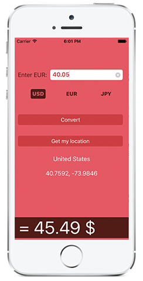
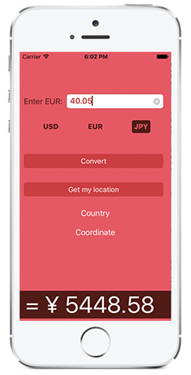
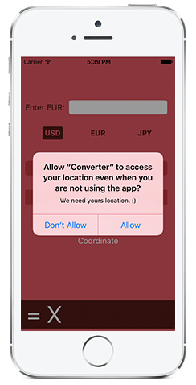

# Simple Converter

Simple iOS Application for converting EUR to JPY, EUR and USD. Target currency can be selected based on Geo Location or at the press of a button. It was developed as an exercise of Core Location Framework. 
 
Dependency: ChameleonFramework
 

